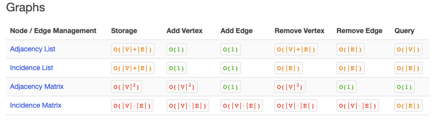

# Graphs
Implement your own Graph.

[Pull Request](https://github.com/etrainor/data-structures-and-algorithms/pull/65)
[Travis]()

## Challenge
Implement a graph with the methods listed below under API.

## Approach & Efficiency
Still need to try and understand more about the Big O of graphs. I found this resource from [Big O Reference Sheet](http://bigoref.com/), that references the V (vertex) and E (the edge) in the big O calculations.

## API
### AddNode()
* Adds a new node to the graph
* Takes in the value of that node
* Returns the added node
### AddEdge()
* Adds a new edge between two nodes in the graph
* Include the ability to have a “weight”
* Takes in the two nodes to be connected by the edge
* Both nodes should already be in the Graph
### GetNodes()
* Returns all of the nodes in the graph as a collection (set, list, or similar)
### GetNeighbors()
* Returns a collection of nodes connected to the given node
* Takes in a given node
* Include the weight of the connection in the returned collection
### Size()
* Returns the total number of nodes in the graph