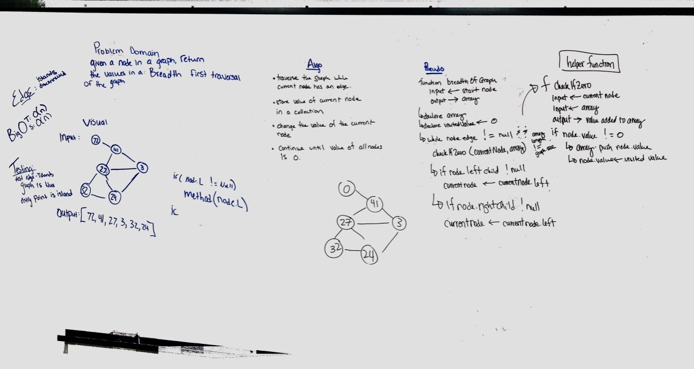

# Breadth-First Traversal of a Graph
Traverse a graph and record the values.

[Pull Request]()

## Challenge
Extend your graph object with a breadth-first traversal method that accepts a starting node. Without utilizing any of the built-in methods available to your language, return a collection of nodes in the order they were visited. Display the collection.

## Approach & Efficiency
We used a breadthFirst traversal and pushed the node values into an array. Once we had visited a node and recorded its value we changed the value of the node to zero. We are increasing the space of the graph in order to store the node values as an array so the space is probably O(n)... as many nodes as exist in the graph. Time would also be O(n) because we have to touch each of them.

## Solution

