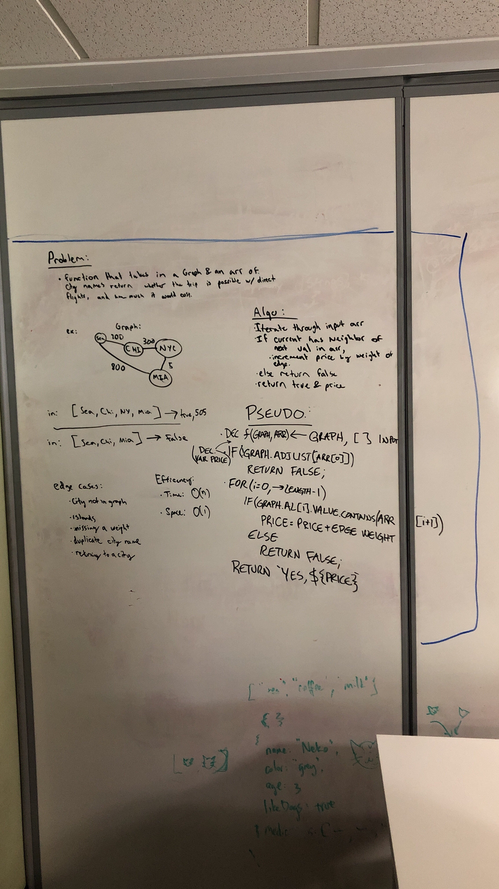

# Find Edges
Given a business trip itinerary, and an Alaska Airlines route map, is the trip possible with direct flights? If so, how much will the total trip cost be?

## Challenge
Write a function based on the specifications above, which takes in a graph, and an array of city names. Without utilizing any of the built-in methods available to your language, return whether the full trip is possible with direct flights, and how much it would cost.

## Approach & Efficiency
We iterated through the graph, checked if the starting node of the itinerary array was present in the graph and then checked if one of the nodes neighbors was the next value in the input array. Time is O(n) because you have to touch each index of the array and space is O(1) because you are just checking the existing graph, you don't have to duplicate the structure.

## Solution
