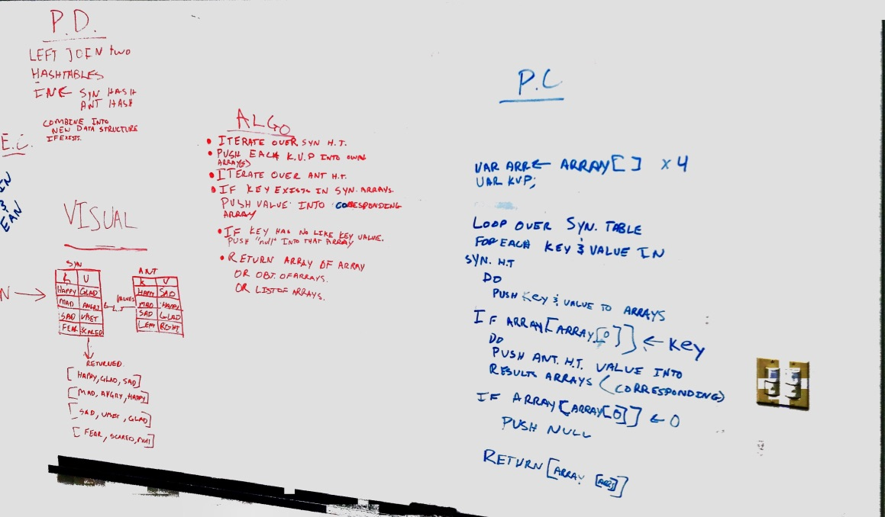

# Hashmap LEFT JOIN
Left join two hash tables based on matching keys.

[PR](https://github.com/etrainor/data-structures-and-algorithms/pull/64)

## Challenge
* Write a function that LEFT JOINs two hashmaps into a single data structure.
* The first parameter is a hashmap that has word strings as keys, and a synonym of the key as values.
* The second parameter is a hashmap that has word strings as keys, and antonyms of the key as values.
* Combine the key and corresponding values (if they exist) into a new data structure according to LEFT JOIN logic.
* LEFT JOIN means all the values in the first hashmap are returned, and if values exist in the “right” hashmap, they are appended to the result row. If no values exist in the right hashmap, then some flavor of NULL should be appended to the result row.
* The returned data structure that holds the results is up to you. It doesn’t need to exactly match the output below, so long as it achieves the LEFT JOIN logic.
* Avoid utilizing any of the library methods available to your language.

## Approach & Efficiency
We iterated through the first hash table while pushing all the values into an array of arrays. Then we iterated throught the second hash table checking if the key matched one of the keys from the first hash table. If it did then we added the value to the previously created array. If the key did not exist in the second table we pushed a null value into the array. Any keys in the second hash that were not in the first hash were ignored. I think this has an O(n) space and O(n) time because we are creating as many arrays as there are key:value pairs in the first hash table and we have to iterate over the entirety of both hash tables.

## Solution

