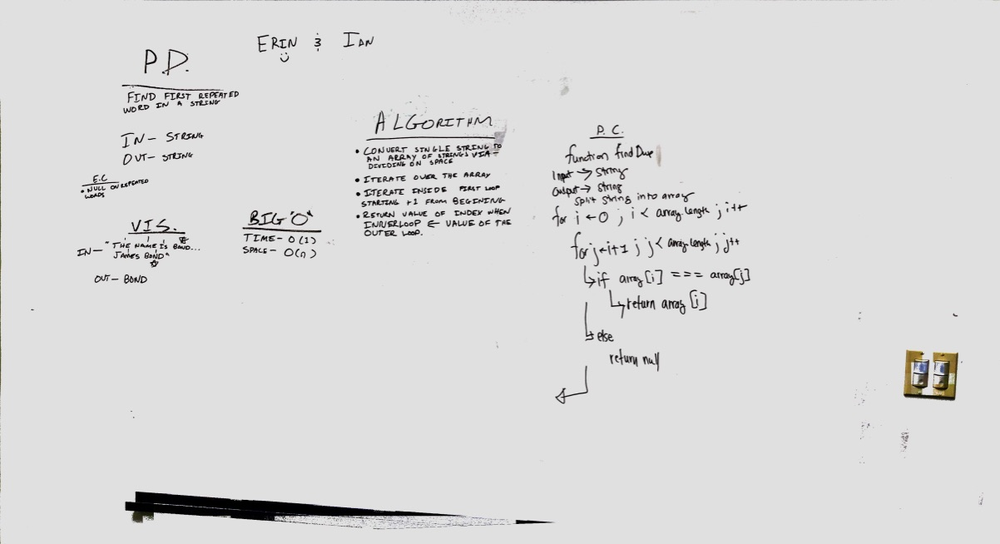

# First repeated word
Find the first repeated word in a book.

[PR](https://github.com/etrainor/data-structures-and-algorithms/pull/62)

## Challenge
* Write a function that accepts a lengthy string parameter.
* Without utilizing any of the built-in library methods available to your language, return the first word to occur more than once in that provided string.

## Approach & Efficiency
We split the input string into an array of strings and used a nested for loop to itterate over the array until the words matched. I don't think this is the most efficient way to do this since you end up itterating over the same (possibly very large array) many times. However, in the time provided, my partner and I could not conceptualize a method using hash tables. Our current solution has a time of O(n2) due to the nested loop and a space of O(n) since we are duplicating the string.

## Solution

