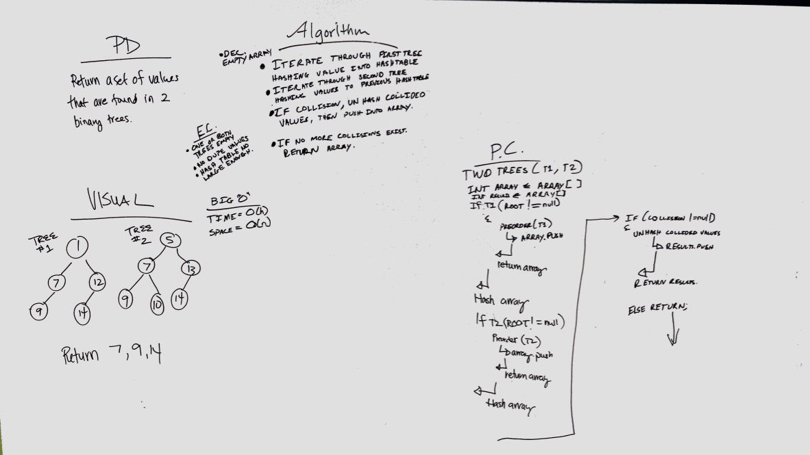

# Intersection of binary trees
Find the like values between two binary trees.

## Challenge
* Write a function called tree_intersection that takes two binary tree parameters.
* Without utilizing any of the built-in library methods available to your language, return a set of values found in both trees.

## Approach & Efficiency
We traversed each binary tree while pushing each value into an array. After collecting the values we hashed them and then also hashed the values from the second tree. When there was a collision we saved those values to a results array. 

## Solution
