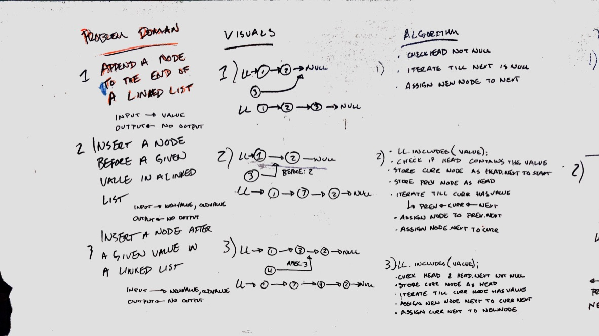
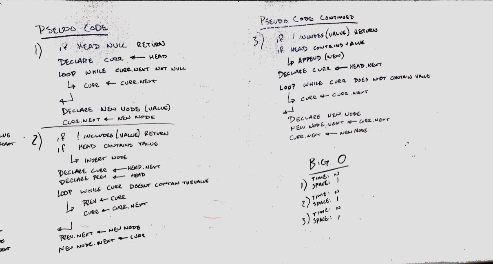
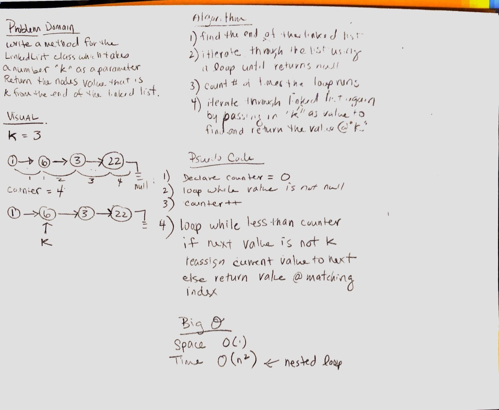

## Code: Implement a Linked List
[Pull Request for `insert`, `includes`, and `print` methods](https://github.com/etrainor/data-structures-and-algorithms/pull/43)

[Pull Request for `append`, `insertBefore`, and `insertAfter` methods](https://github.com/etrainor/data-structures-and-algorithms/pull/45)

[Pull Request for `findKfromEnd`](https://github.com/etrainor/data-structures-and-algorithms/pull/46)

# Singly Linked List
Implement a Linked List using JavaScript classes.

## Challenge
* Create a Node class that has properties for the value stored in the Node, and a pointer to the next Node.
* Within your LinkedList class, include a head property. Upon instantiation, an empty Linked List should be created.
  * This object should be aware of a default empty value assigned to head when the linked list is instantiated.
  * Define a method called `insert` which takes any value as an argument and adds a new node with that value to the head of the list with an O(1) Time performance.
  * Define a method called `includes` which takes any value as an argument and returns a boolean result depending on whether that value exists as a Node’s value somewhere within the list.
  * Define a method called `print` which takes in no arguments and returns a collection all of the current Node values in the Linked List.
  * Define a method called `append` which adds a new node with the given value to the end of the list
  * Define a method called `insertBefore` which adds a new node with the given newValue immediately before the first value node
  * Define a method called `insertAfter` which adds a new node with the given newValue immediately after the first value node
  * At no time should an exception or stack trace be shown to the end user. Catch and handle any such exceptions and return a printed value or operation which cleanly represents the state and either stops execution cleanly, or provides the user with clear direction and output.
  * Be sure to follow your language/frameworks standard naming conventions

## Approach & Efficiency
* I created a `Node` and `LinkedList` class per the instructions in the challenge.
* The `insert` method reassigns the `head` designation to the new `Node` that is inserted at the beginning of the linked list. 

  * The function has a time efficiency of O(n) and a space efficiency of O(1).

* The `includes` method starts at the head of the linked list and iterates through until the value of the current node equals the value passed as an argument or until it reaches the end of the list. The method returns a boolean value.

  * The function has a time efficiency of O(n) and a space efficiency of O(1).

* The `print` method iterates through the entire linked list and returns a string containing the values of the nodes.

  * The function stores the returned value as a string (I think this means it is making a copy??) so the space efficiency is O(n). It has a time efficiency of O(n).

* The `append` method takes in a value and inserts it as the value of a new node at the end of a linked list.

  * The function has a time efficiency of O(n) and a space efficiency of O(1).

* The `insertBefore` method takes in a newValue and an oldValue and assigns the newValue to a new `Node` before the node that contains the oldValue.

  * The function has a time efficiency of O(n) and a space efficiency of O(1).

* The `insertAfter` method takes in a newValue and an oldValue and assigns the newValue to a new `Node` after the node that contains the oldValue.

  * The function has a time efficiency of O(n) and a space efficiency of O(1).

## API
* Each `Node` on the linked list has `element` and `next` proeprties. `Next` stores a reference to the next node in the list. The last node has a next value of `null`.
* Each instantiation of the `LinkedList` class has a `head` and a `length` property. The `head` property is initially set to `null` and the `length` property is initially set to `0`. The `LinkedList` class has three methods: `insert`, `includes`, and `print`.

  * The `insert(valueToInsert)` method takes a valueToInsert argument and creates a new `Node` at the beginning of the linked list with the valueToInsert as the node's `element`.

  * The `includes(value)` method takes a value and returns `true` if the value exists as a value stored in one of the nodes of the linked list and `false` if it does not.

  * The `print()` method returns a string with the with the `element` values of the linked list in the order they exist.

  * The `.append(value)` method takes a value argument and creates a new `Node` at the end of the linked list with the value as the node's element.

  * The `insertBefore(oldValue, newValue)` method takes in an oldValue to seach for and a newValue. When the value of the current node matches the value being searched for a new node will be inserted before the current node.

  * The `insertAfter(oldValue, newValue)` method method takes in an oldValue to seach for and a newValue. When the value of the current node matches the value being searched for a new node will be inserted after the current node.

  ## White Board Image for append(), insertBefore(), and insertAfter()

  
  
  
  ## White Board Image for findKfromEnd
  

  ## Partnerships
  Daniel Logerstedt was whiteboard partner for:
    * `append()` 
    * `insertBefore()` 
    * `insertAfter()`