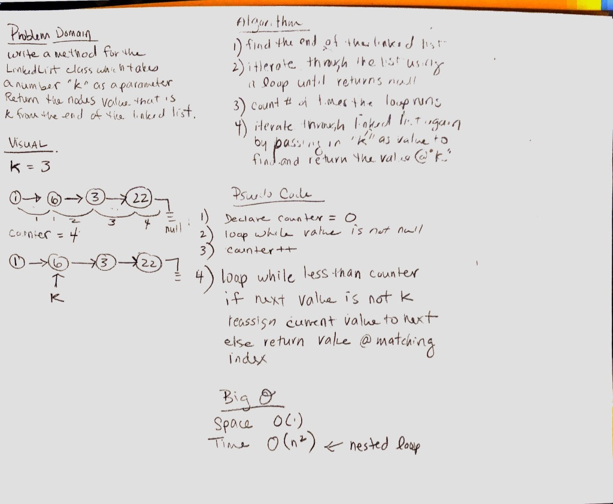

# kth from the end of a Linked List
k-th value from the end of a linked list.

## Challenge
Write a method for the Linked List class which takes a number, k, as a parameter. Return the node’s value that is k from the end of the linked list. You have access to the Node class and all the properties on the Linked List class as well as the methods created in previous challenges.

## Approach & Efficiency
Loop through the linkedList while the next value is not k. It has a time of O(n2) because of the nested loop but a space of O(1) because we don't have to duplicate the list.

## Solution
