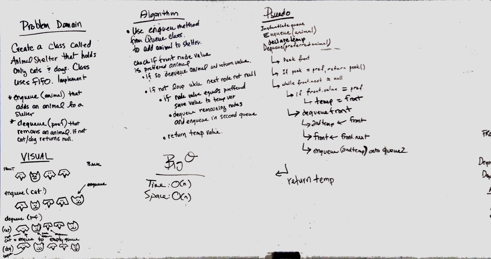

# First-in, First out Animal Shelter.
Use queue methods to manipulate the animals in an animal shelter.

## Challenge
* Create a class called AnimalShelter which holds only dogs and cats. The shelter operates using a first-in, first-out approach.
* Implement the following methods:
  * enqueue(animal): adds animal to the shelter. animal can be either a dog or a cat object.
  * dequeue(pref): returns either a dog or a cat. If pref is not "dog" or "cat" then return null.

## Approach & Efficiency
Using the queue class enqueue method and modifying the dequeue method. We looped through the queue 1 or more times depending on the logic. If the preferred animal was not in the first node we enqueued all animals to a second node so that the "skipped" animal was still at the front of the queue.

## Solution

