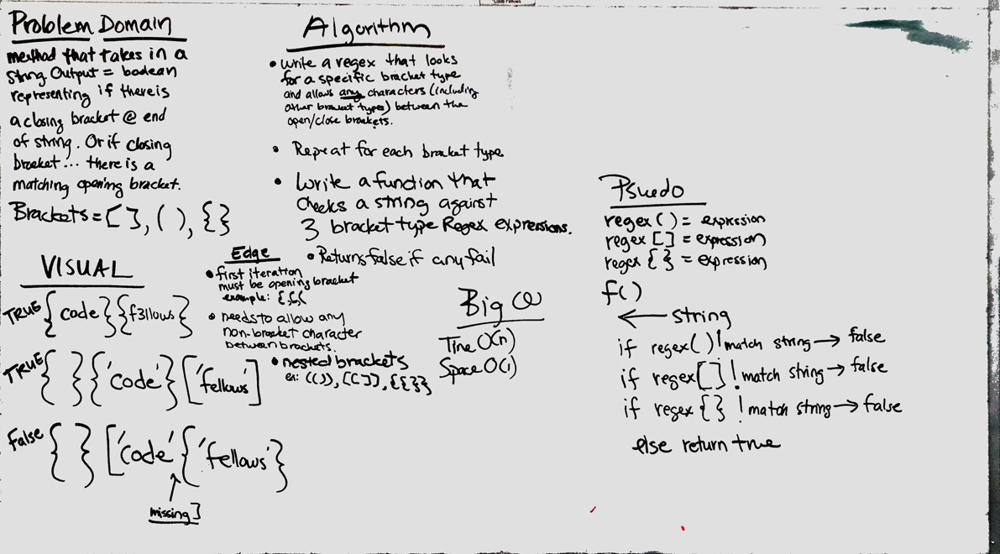

# Multi-bracket Validation.
Multi-bracket Validation

[PR](https://github.com/etrainor/data-structures-and-algorithms/pull/53)

## Challenge
* On your main file, create…

* JavaScript: a function called multiBracketValidation(input)

* Your function should take a string as its only argument, and should return a boolean representing whether or not the brackets in the string are balanced. 

There are 3 types of brackets:

Round Brackets : ()
Square Brackets : []
Curly Brackets : {}

## Approach & Efficiency
Our brute force method intends to use Regex with a space of O(1) and a Time of O(n). I want to reconfigure while attempting to use stacks.

## Solution
