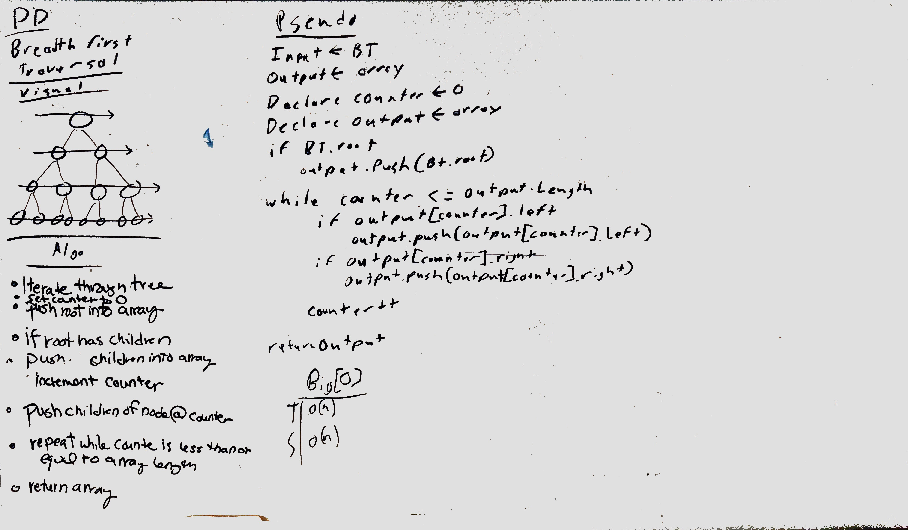

# Breadth-first
Breadth-first Traversal.

[Pull Request](https://github.com/etrainor/data-structures-and-algorithms/pull/58)

## Challenge
Write a breadth first traversal method which takes a Binary Tree as its unique input. Without utilizing any of the built-in methods available to your language, traverse the input tree using a Breadth-first approach; print every visited node’s value.

## Approach & Efficiency
Traverse the tree and push the nodes into an array. Time - O(n) and Space O(n). If we did not return the array the space would be O(width).

## Solution

