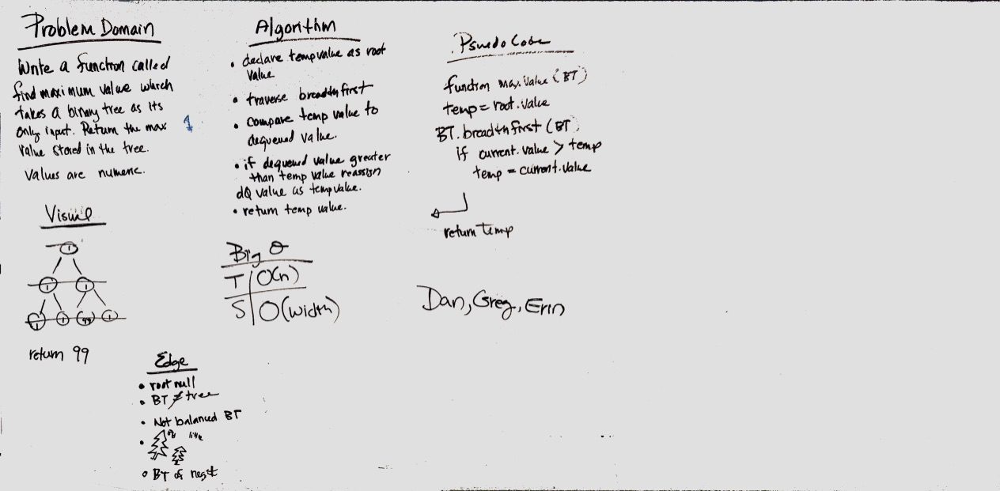

# Find the Maximum Value in a Binary Tree

[Pull Request](https://github.com/etrainor/data-structures-and-algorithms/pull/59)

## Challenge
Write a function called find-maximum-value which takes binary tree as its only input. Without utilizing any of the built-in methods available to your language, return the maximum value stored in the tree. You can assume that the values stored in the Binary Tree will be numeric.

## Approach & Efficiency
We used breadth first method from previous day to traverse the tree and compare the root value to other values. Time is O(n) because you have to touch all nodes and space is O(width).

## Solution

