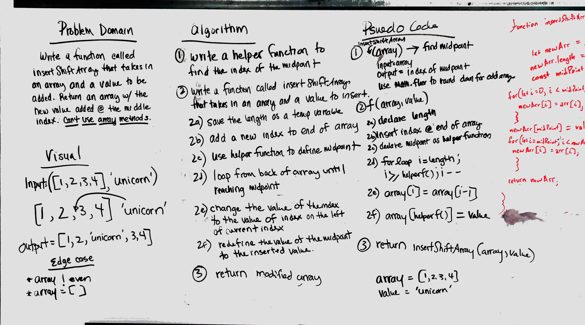

# Shift an Array
Insert a value into the middle of an array without using array methods.

## Challenge
Write a function that takes in an array and a value. The function should insert the value into the middle of the array and return the modified array.

## Approach & Efficiency
Create a helper function to find the middle of the array. Write a function that takes in an array and a value. Insert an index at the end of the array. Use the helper function in the for loop to move backwards through the array until getting to the middle. As the loop moves through the array it re-assigns the value of the index to the previous index.

Not sure how to calculate efficiency yet. 

## Solution
