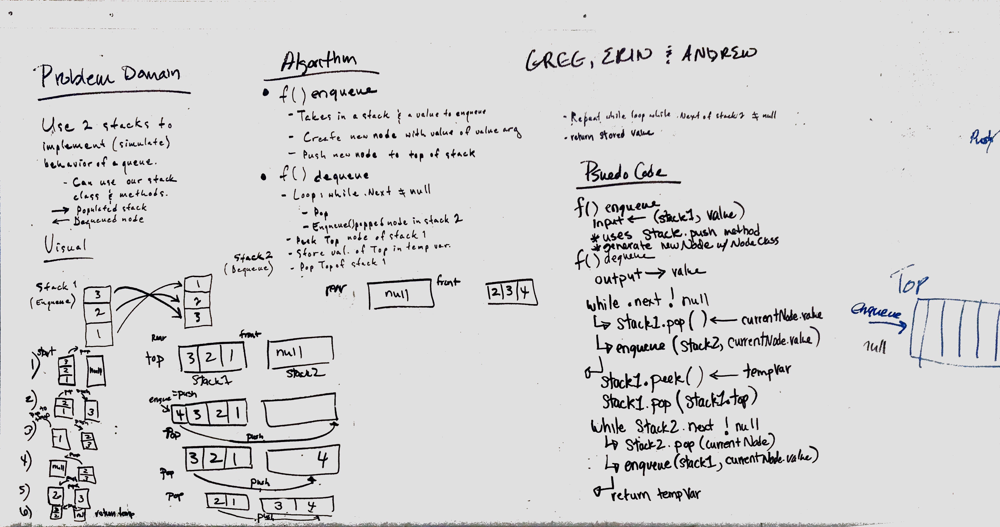

# Implement a Queue using two Stacks.
Implement a Queue using two Stacks.
[PR](https://github.com/etrainor/data-structures-and-algorithms/pull/51)
[Travis]
## Challenge
Create a brand new PseudoQueue class. Do not use an existing Queue. Instead, this PseudoQueue class will implement our standard queue interface (the two methods listed below), but will internally only utilize 2 Stack objects. Ensure that you create your class with the following methods:

*  enqueue(value) which inserts value into the PseudoQueue, using a first-in, first-out approach.
*  dequeue() which extracts a value from the PseudoQueue, using a first-in, first-out approach.

The Stack instances have only push, pop, and peek methods. You should use your own Stack implementation. Instantiate these Stack objects in your PseudoQueue constructor.

## Approach & Efficiency
created a function that uses the Stack.pop and Stack.push methods to emulate the enqueue and dequeue queueu methods.

Time = o(n) - because we have to touch each node 2 times
Space = o(1) - because we are not copying the stack we are just moving nodes back and forth between stacks.

## Solution

